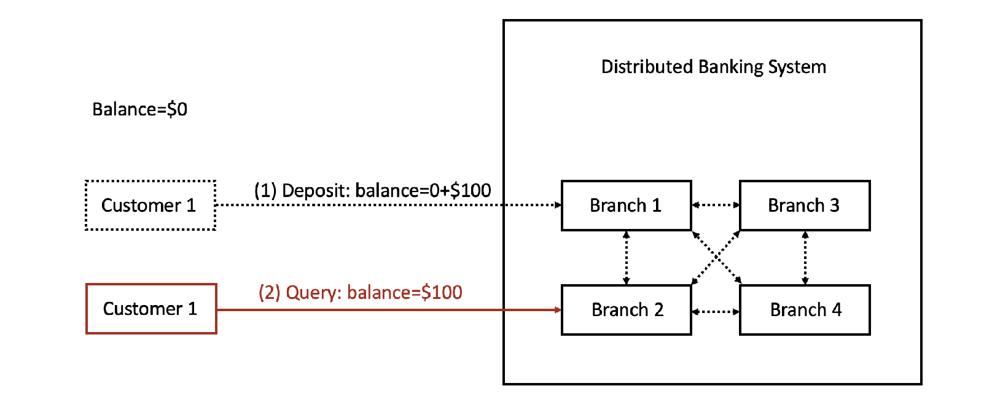

# Client-Centric Consistency in Distributed Banking Systems

## Project Overview

This project explores the implementation of a client-centric consistency model within a distributed banking application, using FastAPI as the backbone for our system. By focusing on the principles of remote procedure calls, logical clocks, and client-centric consistency, we aim to ensure that all read and write operations performed by a customer across different branch processes are accurately tracked and synchronized.

### Key Features

- **Client-Centric Consistency:** Ensures that a customer's write operations in one branch are immediately visible to their subsequent read operations, regardless of the branch.
- **Distributed Transactions:** Allows customers to perform banking transactions like deposits and withdrawals across multiple branches while maintaining data integrity and consistency.
- **Dynamic Interaction:** Customers can interact with any branch, performing operations that reflect in real-time across the system.

### How It Works

The application provides a seamless banking experience for customers, utilizing distributed system concepts to maintain consistency across multiple branches. Whether depositing money at one branch or querying their balance at another, the system guarantees that the customer's view is always up-to-date and consistent with their actions.



This project represents a significant step forward in the practical application of distributed systems concepts to solve real-world challenges in the financial sector.


Installation Steps:

1. Install Python 3.11.X

```bash
$ sudo add-apt-repository ppa:deadsnakes/ppa
```

```bash
$ sudo apt update
```

```bash
$ sudo apt install python3
```

To verify the installation

```bash
$ python3 --version
```

1. Install Python Package manager

```bash
$ sudo apt install python3-pip
```

1. Install Python virtual environment and activate it

```bash
$ sudo apt install python3-virtualenv
$ virtualenv venv
$ source venv/bin/activate
> (venv) user@user: ~path
$ python -m pip install --upgrade pip
```

1. Install requirements
    1. After activating your virtual environment run the following commands
    
    ```bash
    $ pip3 install -r requirements.txt
    ```
    
2. Run the script using from file `main.py`
    
    ```bash
    $ python3 main.py <file_path>
    ```
    
    Example:
    
    ```protobuf
    $ python3 main.py input.json
    ```
    
    This starts the server and all the Branch and Customer objects are instantiated with the data provided in `input.json` and the processes are started.
    
3. Results are stored
    1. Customer outputs → `customer_outputs.json`
    2. Branch outputs → `branch_outputs.json`
    3. Event outputs → `event_outputs.json`
4. Customer processes debug logs are stored in `customerDebug.txt`
5. Branch processes debug logs are stored in `branchDebug.txt`